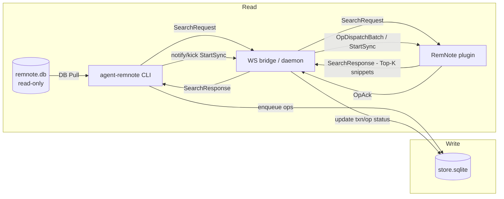

# agent-remnote

English | [简体中文](README.zh-CN.md)

> Programmable RemNote for AI agents: **read locally**, **search via the UI**, **write safely**.

`agent-remnote` is a CLI + RemNote plugin that turns your RemNote knowledge base into a safe automation surface:

- **Read (DB Pull)**: deterministic, read-only queries against local `remnote.db`.
- **Read (Plugin RPC)**: fast Top‑K candidate search (with snippets) via the RemNote plugin over WebSocket.
- **Write (Queue → WS → Plugin)**: safe persistence via an operation queue + WS bridge + plugin executor (official SDK).
- **Agent-friendly I/O**: clean stdout, diagnostics to stderr, and a stable `--json` envelope.

This repo is optimized for the “agent calls CLI” workflow, not for humans clicking around.

## Safety boundaries

- Never modify RemNote’s official database (`remnote.db`) directly.
- All writes must go through the “queue → WS → plugin executor” pipeline.

## Why this exists

- RemNote data is local, but not easily scriptable.
- Direct DB writes are unsafe (indexes / sync / upgrades).
- Agents need reliable, machine-friendly interfaces (stable JSON, predictable fallbacks).

## Documentation

- Docs index: `docs/README.md`
- Protocols & contracts (SSoT): `docs/ssot/agent-remnote/README.md`
- Guides (debugging, tmux, etc.): `docs/guides/`
- Contribution guide: `CONTRIBUTING.md`
- Security policy: `SECURITY.md`

## Use cases (RemNote workflows)

- Find TODOs quickly (read-only): `agent-remnote --json todo list --status unfinished --sort updatedAtDesc --limit 20`
- List built-in powerups (read-only): `agent-remnote --json powerup list`
- Resolve a powerup (read-only): `agent-remnote --json powerup resolve --powerup "Todo"`
- Add structured data through the primary table surface: `agent-remnote --json table record add --table-tag "<tag_id>" --parent "<parent_id>" --text "..."`
- Mark a Rem as Todo (safe write): `agent-remnote --json todo add --rem "<rem_id>" --wait`
- Dump everything into one place (safe write): `agent-remnote --json rem children append --subject "page:Inbox" --markdown @./note.md`
- Process external info → summarize → auto-file into RemNote: generate `./summary.md` then `agent-remnote --json rem children append --subject "page:Reading" --markdown @./summary.md`

## Installation (users)

### Prerequisites

- RemNote Desktop (for the plugin executor).
- Node.js 20+ (for the CLI).

### CLI

```bash
npm i -g agent-remnote
agent-remnote --help
```

### RemNote plugin (Executor)

You need the plugin for **writes** and **Plugin RPC** reads.

The marketplace package is not the recommended path right now. Until the official RemNote marketplace submission is approved, use the built-in local HTTP serve flow below and load it from RemNote's Developer plugin URL.

Local URL workflow:

1. Start the built-in local HTTP plugin server:

```bash
agent-remnote plugin start
```

This is the recommended user path. It starts the local plugin server in the background and returns a reusable local URL.

Check and manage the background server with:

```bash
agent-remnote plugin status
agent-remnote plugin logs --lines 50
agent-remnote plugin stop
```

If you want the foreground debug mode instead, use:

```bash
agent-remnote plugin serve
```

`plugin serve` keeps the server attached to the current terminal and prints a Vite-like `Local:` line. Add `--debug` to also print `Dist:`.

2. In RemNote → Settings → Plugins → Developer, load the plugin from `http://127.0.0.1:8080`.

Zip workflow:

1. Download `PluginZip.zip` (from Releases, if available), or build it from source (see “Development & debugging”).
2. In RemNote → Settings → Plugins → Developer → Install From Zip → select `PluginZip.zip`.

### WS bridge (daemon)

```bash
agent-remnote daemon ensure
agent-remnote --json daemon health
```

### Verify everything is connected

```bash
agent-remnote --json daemon status
```

You should see a `remnote-plugin` client and an `activeWorkerConnId`.

### Host API (authoritative on host, reusable from local and remote callers)

If you want callers to access RemNote through the host, do not mount `remnote.db` / `store.sqlite` directly. Prefer:

```bash
agent-remnote stack ensure
agent-remnote api status --json
```

Direct HTTP:

```bash
curl http://127.0.0.1:3000/v1/health
```

Recommended one-time config for any remote caller:

```json
{
  "apiBaseUrl": "http://host.docker.internal:3000"
}
```

`apiBaseUrl` can be any reachable base URL. It may already include the path prefix:

```json
{
  "apiBaseUrl": "https://host.example.com/remnote/v1"
}
```

If you expose `apiBaseUrl` outside the host, put it behind an explicit auth boundary first. Sensitive write routes such as `POST /v1/write/apply` are intended for trusted callers only.

Or write it through the CLI:

```bash
agent-remnote config set --key apiBaseUrl --value http://host.docker.internal:3000
agent-remnote config set --key apiHost --value 0.0.0.0
agent-remnote config set --key apiPort --value 3001
agent-remnote config set --key apiBasePath --value /v1
agent-remnote config validate
```

Save it to `~/.agent-remnote/config.json`, then keep using the same business commands:

```bash
agent-remnote search --query "keyword"
agent-remnote queue wait --txn "<txn_id>"
agent-remnote plugin selection current
agent-remnote plugin selection current --compact
agent-remnote plugin current --compact
```

Strict remote mode rule:

- When `apiBaseUrl` is configured, business commands must use the host API.
- `REMNOTE_API_BASE_URL` and user config `apiBaseUrl` are equivalent inputs in the same precedence chain.
- `apiBasePath` only affects listener/status URL assembly. If `apiBaseUrl` already includes a path prefix, that prefix wins.
- The authoritative inventory for parity-mandatory business commands lives in
  `docs/ssot/agent-remnote/runtime-mode-and-command-parity.md`.
- Commands that still depend on direct local DB/filesystem access now fail fast instead of silently falling back to local reads.
- Deferred write commands that only compile `ops` must also use the host API in remote mode instead of enqueueing to the caller-side local store.
- Remote-capable examples now include `search`, `queue wait`, `plugin current`, `rem outline`, `daily rem-id`, `daily write`, and `rem children *`.
- For structured writes in remote mode, use `daily write --markdown ...`, `rem children ...`, or `apply --payload ...`.
- `powerup todo ...` is the canonical Todo command family; top-level `todo ...` remains as a high-frequency alias.

Overrides are still available when needed:

```bash
REMNOTE_API_BASE_URL=http://host.docker.internal:3000 agent-remnote queue wait --txn "<txn_id>"
agent-remnote --api-base-url http://host.docker.internal:3000 plugin current --compact
agent-remnote --api-host 127.0.0.1 --api-port 3001 --api-base-path /v2 --json config print
```

## Quick start (users)

Plugin RPC (fast candidates, requires an active RemNote window + plugin):

```bash
agent-remnote --json plugin search --query "keyword" --timeout-ms 3000
```

DB Pull (deterministic fallback, works without the plugin):

```bash
agent-remnote --json search --query "keyword" --timeout-ms 30000
```

Safety defaults: most list-like read commands are paginated with a default `--limit` (and an enforced max) to avoid scanning huge vaults.

Safe write + progress tracking:

```bash
agent-remnote --json rem children append --subject "page:Inbox" --markdown @./note.md --idempotency-key "inbox:note:2026-01-25"
agent-remnote --json queue wait --txn "<txn_id>"
```

## Real-world recipes

All write recipes require a connected RemNote window + plugin (active worker) and a running daemon. Check: `agent-remnote --json daemon status`.

### 1) Research summary → Reading page (Markdown import)

```bash
agent-remnote --json rem children append --subject "page:Reading" --markdown @./summary.md --idempotency-key "reading:summary:2026-01-26"
agent-remnote --json queue wait --txn "<txn_id>"
```

### 2) Daily Notes journaling (append or prepend)

```bash
agent-remnote --json daily write --markdown @./daily.md --create-if-missing --idempotency-key "daily:2026-01-26:journal"
agent-remnote --json queue wait --txn "<txn_id>"
```

Inline Markdown / stdin are also supported:

```bash
agent-remnote --json daily write --markdown $'- topic\n  - note' --wait
cat <<'MD' | agent-remnote --json daily write --markdown - --wait
- topic
  - note
MD
```

Guardrail: if `--text` input looks like structured Markdown, the CLI fails fast and asks you to use `--markdown`. Use `--force-text` only when you intentionally want literal Markdown text.

### 3) Multi-step writes with dependencies (`apply --payload`)

Create `plan.json`:

```json
{
  "version": 1,
  "kind": "actions",
  "actions": [
    { "as": "idea", "action": "write.bullet", "input": { "parent_id": "id:<parentRemId>", "text": "First bullet" } },
    { "action": "rem.children.append", "input": { "rem_id": "@idea", "markdown": "- child note" } }
  ]
}
```

```bash
agent-remnote --json apply --payload @plan.json --idempotency-key "plan:demo:2026-01-26"
agent-remnote --json queue wait --txn "<txn_id>"
```

`apply` also expands `markdown` fields inside action/op payloads using the same input-spec semantics as `--markdown`: inline text, `@file`, `-`, and `@@literal`.

## Usage with AI agents

### Read: two complementary channels

1. **Plugin RPC (fast candidates)**  
   Requires a connected RemNote window + plugin (active worker). Returns Top‑K candidates with snippets.

```bash
agent-remnote --json plugin search --query "keyword" --timeout-ms 3000
```

2. **DB Pull (deterministic fallback)**  
   Read-only query against `remnote.db` (works without the plugin).

```bash
agent-remnote --json search --query "keyword" --timeout-ms 30000
```

If Plugin RPC is unavailable, the command returns `ok=false` with `error.code` and `nextActions` (you can always fall back to DB Pull).

### Write: queue + plugin executor

Writes never touch `remnote.db` directly. They go through the operation queue and are applied by the plugin via the official SDK.

```bash
agent-remnote --json rem children append --subject "page:Inbox" --markdown @./note.md --idempotency-key "inbox:note:2026-01-25"
agent-remnote --json queue wait --txn "<txn_id>"
```

Tip: always pass a stable `--idempotency-key` for “the same logical write” so retries don’t create duplicate Rems.

### Bulk-safe writes (bundle)

When writing large content, injecting hundreds of Rems directly under an existing page is risky and hard to clean up.

`rem children append/prepend/replace` and `daily write` support a **bundle mode**: large inputs (default: ≥80 lines or ≥5000 chars) are wrapped into a single “container Rem”, and the container Rem text is the bundle title.

For `daily write --markdown`, the auto path keeps a large single-root outline as-is and skips the extra bundle unless you force it or provide `--bundle-title`.

- Disable bundling: `--bulk never`
- Force bundling: `--bulk always`
- Customize the container: `--bundle-title ...`
- Reduce UI “waterfall” flicker: `--staged` (imports under a temporary container, then moves roots into place once)

Example:

```bash
agent-remnote --json daily write --markdown @./big.md \
  --bundle-title "X thread: Remotion workflow — Remotion + skills pipeline; align cuts to TTS segment lengths" \
  --idempotency-key "reading:x:2015245301603549328"
agent-remnote --json queue wait --txn "<txn_id>"
```

### Targeting the right window: active worker

Only the most recently active RemNote window is elected as the **active worker**:

- It is the only connection allowed to consume queued ops.
- It is also the target for Plugin RPC (e.g. `plugin search`).

If you have multiple RemNote windows: click the one you want to target.

### Agent integration (Skill) — Claude Code / Codex

This repo ships a `remnote` Skill (Agent Skills spec). Install it via https://github.com/vercel-labs/add-skill :

```bash
npx add-skill https://github.com/yoyooyooo/agent-remnote -g -a codex -a claude-code -y --skill remnote
```

## Command cheat sheet

| Goal                                     | Command                                                                                                                                           |
| ---------------------------------------- | ------------------------------------------------------------------------------------------------------------------------------------------------- |
| Health / liveness                        | `agent-remnote --json daemon health`                                                                                                              |
| Inspect daemon + clients + active worker | `agent-remnote --json daemon status`                                                                                                              |
| Plugin candidate search (Top‑K)          | `agent-remnote --json plugin search --query "..."`                                                                                                |
| DB search (fallback)                     | `agent-remnote --json search --query "..."`                                                                                                       |
| UI context snapshot (IDs)                | `agent-remnote --json plugin ui-context snapshot`                                                                                                 |
| Resolve today's Daily Note Rem ID        | `agent-remnote --ids daily rem-id`                                                                                                                |
| Resolve a specific Daily Note Rem ID     | `agent-remnote --json daily rem-id --date "2026-03-08"`                                                                                           |
| Append Markdown to a Rem's children      | `agent-remnote --json rem children append --subject "page:..." --markdown @./note.md`                                                            |
| Prepend Markdown to a Rem's children     | `agent-remnote --json rem children prepend --subject "page:..." --markdown @./note.md`                                                           |
| Replace a Rem's direct children          | `agent-remnote --json rem replace --subject "page:..." --surface children --markdown @./note.md`                                                 |
| Replace selected sibling Rems in place   | `agent-remnote --json rem replace --selection --surface self --markdown @./note.md`                                                                |
| Clear a Rem's direct children            | `agent-remnote --json rem children clear --subject "<rem_id>" --wait`                                                                            |
| Write Daily Note Markdown inline         | `agent-remnote --json daily write --markdown $'- topic\n  - note' --wait`                                                                         |
| Write Daily Note Markdown from stdin     | `cat note.md \| agent-remnote --json daily write --markdown - --wait`                                                                             |
| Create a Portal                          | `agent-remnote --json portal create --to "id:<rem_id>" --at "parent:id:<parent_id>" --wait`                                                     |
| Read typed outline nodes                 | `agent-remnote --json rem outline --id "<rem_id>" --depth 3 --format json`                                                                        |
| Query normalized recent activity         | `agent-remnote --json db recent --days 7 --kind all --aggregate day --aggregate parent --timezone Asia/Shanghai --item-limit 20 --aggregate-limit 10` |
| Create a short child Rem                 | `agent-remnote --json rem create --at "parent:id:<parent_id>" --text "..." --wait`                                                               |
| Promote markdown into a standalone page  | `agent-remnote --json rem create --at standalone --is-document --title "..." --markdown @./note.md --portal "at:parent:daily:today" --wait`     |
| Promote selected/known content           | `agent-remnote --json rem create --at standalone --title "..." --from "id:<rem_id>" [--from "id:<rem_id>"] --wait`                              |
| Move a Rem                               | `agent-remnote --json rem move --subject "id:<rem_id>" --at "parent[0]:id:<parent_id>" --wait`                                                  |
| Promote a Rem and leave a portal         | `agent-remnote --json rem move --subject "id:<rem_id>" --at standalone --is-document --portal in-place --wait`                                   |
| Update Rem text                          | `agent-remnote --json rem set-text --subject "<rem_id>" --text "..." --wait`                                                                     |
| Tag Rems                                 | `agent-remnote --json tag add --tag "<tag_id>" --to "<rem_id>" [--to "<rem_id>"]`                                                              |
| Un-tag Rems                              | `agent-remnote --json tag remove --tag "<tag_id>" --to "<rem_id>" [--to "<rem_id>"]`                                                           |
| Powerup schema (read-only inspection)    | `agent-remnote --json powerup schema --powerup "Todo" --include-options`                                                                          |
| Todo: mark done                          | `agent-remnote --json todo done --rem "<rem_id>" --wait`                                                                                          |
| Table: create a table                    | `agent-remnote --json table create --table-tag "<tag_id>" --parent "<parent_id>" --wait`                                                          |
| Table: add a row                         | `agent-remnote --json table record add --table-tag "<tag_id>" --parent "<parent_id>" --text "..."`                                                |
| Delete a Rem                             | `agent-remnote --json rem delete --subject "<rem_id>" [--max-delete-subtree-nodes 100]`                                                         |
| Structured multi-step write              | `agent-remnote --json apply --payload @plan.json`                                                                                                 |
| Raw ops enqueue (advanced)               | `agent-remnote --json apply --payload @ops.json`                                                                                                  |
| List backup artifacts                    | `agent-remnote --json backup list`                                                                                                                |
| Dry-run orphan backup cleanup            | `agent-remnote --json backup cleanup`                                                                                                             |
| Dry-run exact backup cleanup             | `agent-remnote --json backup cleanup --backup-rem-id "<backup_rem_id>" [--max-delete-subtree-nodes 100]`                                        |
| Wait for completion                      | `agent-remnote --json queue wait --txn "<txn_id>"`                                                                                                |
| Queue stats                              | `agent-remnote --json queue stats`                                                                                                                |
| Queue stats (+ conflict summary)         | `agent-remnote --json queue stats --include-conflicts`                                                                                            |
| Conflict surface report                  | `agent-remnote --json queue conflicts`                                                                                                            |
| Debug logs                               | `agent-remnote daemon logs --lines 200`                                                                                                           |

Most write commands also support `--wait --timeout-ms <ms> --poll-ms <ms>` to close the loop in a single call. In wait-mode receipts, parse `id_map` first; wrapper-specific ids such as `rem_id` or `portal_rem_id` are secondary sugar derived from the same mapping.

`rem delete` keeps the same CLI surface, but the plugin now defaults to a frontend-local `safeDeleteSubtree` strategy: small subtrees are deleted directly, while large trees are partitioned into threshold-bounded rooted subtrees before deletion. Use `--max-delete-subtree-nodes <n>` when you want to probe a different threshold without reloading the plugin.

## Runtime Version Checks

When local iteration gets confusing, use these first:

```bash
agent-remnote --json daemon status
agent-remnote --json plugin status
agent-remnote --json api status
agent-remnote --json stack status
agent-remnote --json doctor
```

What they now expose:

- `runtime`: the current CLI/session build
- `service.build`: the live daemon/api/plugin-server process build when available
- `clients[].runtime` or `active_worker.runtime`: the live RemNote plugin build when connected
- `warnings`: explicit mismatch hints when you are still talking to an old daemon/api/plugin
- `doctor.queue.schema`: current and supported store schema versions

If you still see old `build_id` values after code changes, restart the affected process:

```bash
agent-remnote --json daemon restart --wait 15000
agent-remnote --json api restart
agent-remnote --json plugin restart
```

## Optional: tmux statusline (RN segment)

If you use tmux, this repo includes a small helper for a right-side `RN` segment that reflects daemon liveness and UI selection:

- Hidden when the daemon is down/off/stale (shows nothing).
- Grey background when the daemon is up but no clients are connected.
- Warm background when at least one client is connected (and the label follows selection: `RN` / `TXT` / `N rems`).
- Appends `↓N` when there are queued ops (`pending` + `in_flight`).

It is implemented by reading the daemon state file (`~/.agent-remnote/ws.bridge.state.json`) + store DB, so tmux does not need to spawn Node on every redraw.

- tmux-friendly script: `scripts/tmux/remnote-right-segment.tmux.sh`
- Advanced value script (returns `"<bg>\t<value>"`): `scripts/tmux/remnote-right-value.sh`

Fast path dependency: `jq` (recommended) and `sqlite3` (optional, for `↓N`). Without `jq`, it degrades to a best-effort CLI fallback.

See `docs/guides/tmux-statusline.md` for wiring and knobs.

## Architecture (high level)



## Troubleshooting

- `agent-remnote daemon ensure` prints `started: false`: it can mean “already healthy, nothing to start”; use `agent-remnote --json daemon status` to confirm.
- `agent-remnote stack ensure`: one command to make both `daemon + api` ready.
- If you want to wait until the plugin worker becomes active again: `agent-remnote stack ensure --wait-worker --worker-timeout-ms 15000`
- No `remnote-plugin` client in `daemon status`: reinstall the plugin zip and keep a RemNote window open.
- Plugin RPC fails / no `activeWorkerConnId`: click inside the target RemNote window to refresh UI activity.

## Configuration

- RemNote DB (read-only): `--remnote-db` / `REMNOTE_DB`
- Store DB: `--store-db` / `REMNOTE_STORE_DB` / `STORE_DB` (default: `~/.agent-remnote/store.sqlite`; legacy: `--queue-db` / `REMNOTE_QUEUE_DB` / `QUEUE_DB`)
- WS endpoint: `--daemon-url` / `REMNOTE_DAEMON_URL` / `DAEMON_URL` (or `--ws-port` / `REMNOTE_WS_PORT` / `WS_PORT`, default port 6789)
- Host API remote mode sources: `--api-base-url` / `REMNOTE_API_BASE_URL` / user config `apiBaseUrl`
- Host API listen host: `--api-host` / `REMNOTE_API_HOST` / user config `apiHost` (default `0.0.0.0`)
- Host API port: `--api-port` / `PORT` / `REMNOTE_API_PORT` / user config `apiPort` (default `3000`)
- Host API base path: `--api-base-path` / `REMNOTE_API_BASE_PATH` / user config `apiBasePath` (default `/v1`)
- User config file override: `--config-file` / `REMNOTE_CONFIG_FILE`
- Host API pid/log/state (env-only): `REMNOTE_API_PID_FILE` / `REMNOTE_API_LOG_FILE` / `REMNOTE_API_STATE_FILE`
- WS state file: `REMNOTE_WS_STATE_FILE` / `WS_STATE_FILE` (default: `~/.agent-remnote/ws.bridge.state.json`)
- Daemon pidfile (env-only): `REMNOTE_DAEMON_PID_FILE` / `DAEMON_PID_FILE` (default: `~/.agent-remnote/ws.pid`)
- Daemon log file (env-only): `REMNOTE_DAEMON_LOG_FILE` / `DAEMON_LOG_FILE` (default: `~/.agent-remnote/ws.log`)
- Active worker (auto): determined by recent RemNote UI activity (selection/uiContext); inspect via `agent-remnote daemon status --json` (`activeWorkerConnId`)
- repo: `--repo` / `AGENT_REMNOTE_REPO`
- WS scheduler (env-only): `REMNOTE_WS_SCHEDULER` (set to `0` to disable conflict-aware scheduling; debug only)
- tmux refresh (env-only): `REMNOTE_TMUX_REFRESH` / `REMNOTE_TMUX_REFRESH_MIN_INTERVAL_MS`
- status line file mode (env-only): `REMNOTE_STATUS_LINE_FILE` / `REMNOTE_STATUS_LINE_MIN_INTERVAL_MS` / `REMNOTE_STATUS_LINE_DEBUG` / `REMNOTE_STATUS_LINE_JSON_FILE`
- tmux statusline (RN segment): see `docs/guides/tmux-statusline.md`

Useful: `agent-remnote config path` shows the active user config path; `config list/get/set/unset/validate` manage the user config file; `config set` supports `apiBaseUrl`, `apiHost`, `apiPort`, and `apiBasePath`; `config print` shows the resolved values (including defaults and overrides).

## Development & debugging (from source)

### 1) Install dependencies

```bash
bun install
```

### 2) Start the WS bridge (daemon)

```bash
npm run dev:ws
```

Default WS endpoint: `ws://localhost:6789/ws`

### 3) Build the plugin zip

```bash
cd packages/plugin
npm run build
```

Output: `packages/plugin/PluginZip.zip`

### 4) Serve the plugin from source

```bash
npm run dev -- plugin serve
```

Default URL: `http://127.0.0.1:8080`

Background management mirrors the API/daemon lifecycle:

```bash
npm run dev -- plugin ensure
npm run dev -- plugin status
npm run dev -- plugin stop
```

### 5) Run the CLI from source

```bash
npm run dev -- --help
```

### 6) Quality gate

```bash
npm run check
```

## Release

This repo uses Changesets for npm releases.

- Add a changeset for every release-worthy `agent-remnote` change
- Merge to `master`
- GitHub Actions opens/updates a version PR
- Merging that PR publishes the new npm version via npm Trusted Publishing and updates changelogs

Maintainer runbook: `docs/runbook/release.md`

## Contributing

PRs and issues are welcome. Please read `CONTRIBUTING.md` first for setup, style, and validation expectations.

## Security

If you discover a vulnerability, please follow `SECURITY.md` instead of opening a public issue.

## License

MIT. See `LICENSE`.
