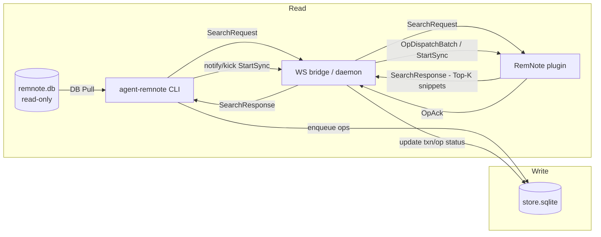

# agent-remnote

[English](README.md) | 简体中文

> 把 RemNote 变成可被 AI/Agent 调用的接口：**本地可读**、**UI 可搜**、**写入安全**。

`agent-remnote` 是一套 CLI + RemNote 插件，把你的 RemNote 知识库变成安全、可自动化的能力面：

- **读（DB Pull）**：对本地 `remnote.db` 做确定性的只读查询。
- **读（Plugin RPC）**：通过 WebSocket 调用 RemNote 插件做“快速候选集搜索”（Top‑K + snippet，结合 UI 上下文）。
- **写（Queue → WS → Plugin）**：通过“操作队列 + WS bridge + 插件执行器（官方 SDK）”安全落库。
- **面向 Agent 的 I/O**：stdout 尽量只输出结果，诊断走 stderr；`--json` 为稳定 envelope。

本仓库主要优化的是“Agent 调用 CLI”的工作流，而不是人类在 UI 里点点点。

## 安全边界（红线）

- 禁止直接修改 RemNote 官方数据库（`remnote.db`）。
- 所有写入必须走「队列 → WS → 插件执行器」链路。

## 为什么要做它？

- RemNote 数据在本地，但天然不“可编程”。
- 直接写 DB 风险极高（索引 / 同步 / 升级都可能被破坏）。
- Agent 需要稳定、可组合的接口（稳定 JSON、可诊断的回退策略）。

## 文档入口

- docs 导航：`docs/README.md`
- 协议与契约（SSoT）：`docs/ssot/agent-remnote/README.md`
- 操作手册（排障 / tmux / 调试等）：`docs/guides/`
- 贡献指南：`CONTRIBUTING.md`
- 安全策略：`SECURITY.md`

## 使用场景（RemNote 侧能获得什么）

- 快速查找 TODO（只读）：`agent-remnote --json todo list --status unfinished --sort updatedAtDesc --limit 20`
- 枚举内置 Powerup（只读）：`agent-remnote --json powerup list`
- 解析 Powerup（只读）：`agent-remnote --json powerup resolve --powerup "Todo"`
- 把某个 Rem 标记为 Todo（安全写入）：`agent-remnote --json todo add --rem "<rem_id>" --wait`
- 把信息集中到一个地方（安全写入）：`agent-remnote --json import markdown --ref "page:Inbox" --file ./note.md`
- 外部信息处理 → 总结 → 自动归档：生成 `./summary.md` 后执行 `agent-remnote --json import markdown --ref "page:Reading" --file ./summary.md`

## 安装（用户）

### 前置条件

- RemNote 桌面端（用于运行插件执行器）。
- Node.js 20+（用于运行 CLI）。

### CLI

```bash
npm i -g agent-remnote
agent-remnote --help
```

### RemNote 插件（Executor）

你需要插件来支持 **写入** 与 **Plugin RPC** 读取。

1) 下载 `PluginZip.zip`（如有 Releases，可从 Releases 获取），或从源码构建（见“从源码开发与调试”）。  
2) RemNote → Settings → Plugins → Developer → Install From Zip → 选择 `PluginZip.zip`。

### WS bridge（daemon）

```bash
agent-remnote daemon ensure
agent-remnote --json daemon health
```

### 验证已连接

```bash
agent-remnote --json daemon status
```

你应该能看到 `remnote-plugin` client 以及 `activeWorkerConnId`。

## 快速开始（用户）

Plugin RPC（快速候选集，需要 RemNote 窗口 + 插件已连接）：

```bash
agent-remnote --json plugin search --query "keyword" --timeout-ms 3000
```

DB Pull（确定性回退，不依赖插件）：

```bash
agent-remnote --json search --query "keyword" --timeout-ms 30000
```

安全兜底：多数 list 类只读命令默认带分页 `--limit`（并有上限），避免在大库上一口气扫太多导致卡死。

安全写入 + 进度查询：

```bash
agent-remnote --json import markdown --ref "page:Inbox" --file ./note.md --idempotency-key "inbox:note:2026-01-25"
agent-remnote --json queue wait --txn "<txn_id>"
```

## 真实场景（可复制 recipes）

所有写入场景都要求：RemNote 窗口 + 插件已连接（active worker）且 daemon 正常运行。检查：`agent-remnote --json daemon status`。

### 1) 研究总结 → 归档到 Reading 页面（Markdown 导入）

```bash
agent-remnote --json import markdown --ref "page:Reading" --file ./summary.md --idempotency-key "reading:summary:2026-01-26"
agent-remnote --json queue wait --txn "<txn_id>"
```

### 2) Daily Notes 日记（追加 / 前插）

```bash
agent-remnote --json daily write --md-file ./daily.md --create-if-missing --idempotency-key "daily:2026-01-26:journal"
agent-remnote --json queue wait --txn "<txn_id>"
```

### 3) 微信文章导入为大纲（可选）

需要一个开启了 CDP 的 Chromium 浏览器（例如 Chrome 启动参数包含 `--remote-debugging-port=9222`）。

```bash
agent-remnote --json import wechat outline --url "<wechat_url>" --ref "page:Inbox" --cdp-port 9222 --idempotency-key "wechat:<id>"
agent-remnote --json queue wait --txn "<txn_id>"
```

### 4) 多步依赖写入（`plan apply`）

创建 `plan.json`：

```json
{
  "version": 1,
  "steps": [
    { "as": "idea", "action": "write.bullet", "input": { "parent_id": "id:<parentRemId>", "text": "First bullet" } },
    { "action": "tag.add", "input": { "rem_id": "@idea", "tag_id": "id:<tagId>" } }
  ]
}
```

```bash
agent-remnote --json plan apply --payload @plan.json --idempotency-key "plan:demo:2026-01-26"
agent-remnote --json queue wait --txn "<txn_id>"
```

## 如何使用（面向 Agent）

### 读取：双通道互补

1) **Plugin RPC（快速候选集）**  
需要 RemNote 窗口 + 插件已连接（active worker）。返回 Top‑K 候选 + snippet。

```bash
agent-remnote --json plugin search --query "keyword" --timeout-ms 3000
```

2) **DB Pull（确定性回退）**  
直接对 `remnote.db` 做只读查询（不依赖插件）。

```bash
agent-remnote --json search --query "keyword" --timeout-ms 30000
```

当 Plugin RPC 不可用时，会返回 `ok=false`，并给出 `error.code` 与 `nextActions`（始终可回退到 DB Pull）。

### 写入：队列 + 插件执行器

写入永远不直接落到 `remnote.db`，而是走队列并由插件通过官方 SDK 执行。

```bash
agent-remnote --json import markdown --ref "page:Inbox" --file ./note.md --idempotency-key "inbox:note:2026-01-25"
agent-remnote --json queue wait --txn "<txn_id>"
```

建议：对“同一次逻辑写入”始终传入稳定的 `--idempotency-key`，这样重试不会产生重复 Rem。

### 批量写入安全约定（bundle）

当内容很大时，把大量 Rem 直接插入到既有页面的根下既危险也难清理。

`import markdown` 与 `daily write` 支持 **bundle 模式**：当输入很大（默认：≥80 行或 ≥5000 字符）时，会先创建一个“容器 Rem”，把导入内容写入容器子树；**容器 Rem 的文本即 bundle title**。

- 禁用 bundling：`--bulk never`
- 强制 bundling：`--bulk always`
- 自定义容器：`--bundle-title ...`
- 减少 UI “逐层出现” 抖动：`--staged`（先在临时容器下完成导入，最后一次性移动到目标 parent）

示例：

```bash
agent-remnote --json import markdown --ref "page:Reading" --file ./big.md \
  --bundle-title "X thread：Remotion 工作流 — Remotion + 多个 skill 的一键成片流程；按 TTS 分段时长裁剪片段" \
  --idempotency-key "reading:x:2015245301603549328"
agent-remnote --json queue wait --txn "<txn_id>"
```

### 指向正确窗口：active worker

系统会选举“最近使用过的 RemNote 会话”为 **active worker**：

- 只有 active worker 允许消费队列；
- Plugin RPC（例如 `plugin search`）也默认路由到 active worker。

如果你开了多个 RemNote 窗口：点一下你想要操作的那个窗口即可完成切换。

### Agent 集成（Skill）— Claude Code / Codex

本仓库提供一个 `remnote` Skill（遵循 Agent Skills spec）。推荐用 https://github.com/vercel-labs/add-skill 一键安装：

```bash
npx add-skill https://github.com/yoyooyooo/agent-renmote -g -a codex -a claude-code -y --skill remnote
```

## 常用命令速查

| 目标 | 命令 |
| --- | --- |
| 健康检查 | `agent-remnote --json daemon health` |
| 查看 daemon/clients/active worker | `agent-remnote --json daemon status` |
| 插件候选集搜索（Top‑K） | `agent-remnote --json plugin search --query "..."` |
| DB 搜索（回退） | `agent-remnote --json search --query "..."` |
| 读取 UI 上下文（IDs） | `agent-remnote --json plugin ui-context snapshot` |
| 写入 Markdown 到页面 | `agent-remnote --json import markdown --ref "page:..." --file ./note.md` |
| 写入 Markdown（插入顶部） | `agent-remnote --json import markdown --ref "page:..." --file ./note.md --position 0` |
| 写入 Markdown（staged 一次性插入） | `agent-remnote --json import markdown --ref "page:..." --file ./note.md --staged` |
| 创建 Portal（传送门） | `agent-remnote --json portal create --parent "<parent_id>" --target "<rem_id>" --wait` |
| 创建 Rem | `agent-remnote --json rem create --parent "<parent_id>" --text "..." --wait` |
| 移动 Rem | `agent-remnote --json rem move --rem "<rem_id>" --parent "<parent_id>" --position 0 --wait` |
| 更新 Rem 文本 | `agent-remnote --json rem text --rem "<rem_id>" --text "..." --wait` |
| 给 Rem 加 Tag | `agent-remnote --json tag add --rem "<rem_id>" --tag "<tag_id>"` |
| 给 Rem 移除 Tag | `agent-remnote --json tag remove --rem "<rem_id>" --tag "<tag_id>"` |
| Powerup schema（Tag + properties） | `agent-remnote --json powerup schema --powerup "Todo" --include-options` |
| Powerup apply（打 Tag + 设值） | `agent-remnote --json powerup apply --rem "<rem_id>" --powerup "Todo" --values '[{\"propertyName\":\"Status\",\"value\":\"Unfinished\"}]' --wait` |
| Todo：标记完成 | `agent-remnote --json todo done --rem "<rem_id>" --wait` |
| Table：创建表 | `agent-remnote --json table create --table-tag "<tag_id>" --parent "<parent_id>" --wait` |
| Table：新增一行 | `agent-remnote --json table record add --table-tag "<tag_id>" --parent "<parent_id>" --text "..."` |
| 删除 Rem | `agent-remnote --json rem delete --rem "<rem_id>"` |
| 批量写入计划（多步依赖） | `agent-remnote --json plan apply --payload @plan.json` |
| raw ops 入队（advanced） | `agent-remnote --json apply --payload @ops.json` |
| 等待完成 | `agent-remnote --json queue wait --txn "<txn_id>"` |
| 队列统计 | `agent-remnote --json queue stats` |
| 队列统计（含冲突摘要） | `agent-remnote --json queue stats --include-conflicts` |
| 查看冲突面报告 | `agent-remnote --json queue conflicts` |
| 查看日志 | `agent-remnote daemon logs --lines 200` |

多数写入命令也支持 `--wait --timeout-ms <ms> --poll-ms <ms>`，用于一次调用闭环确认 txn 终态。

## 可选：tmux statusline（右下角 RN 段）

如果你日常在 tmux 里工作，本仓库提供了一个轻量脚本，用来在右下角显示 `RN` 段，实时反映 daemon 的存活/连接状态与 UI selection：

- daemon 未运行 / state file stale：不显示（输出为空）
- daemon 已运行但无连接：灰底
- daemon 已运行且有连接：暖底（并随 selection 显示 `RN` / `TXT` / `N rems`）
- 当队列存在待处理任务时追加 `↓N`（`pending` + `in_flight`）

实现上直接读取 daemon 的 state file（`~/.agent-remnote/ws.bridge.state.json`）与 store DB，因此 tmux 渲染时不需要每次都启动 Node/CLI。

- tmux 友好脚本：`scripts/tmux/remnote-right-segment.tmux.sh`
- 底层 value 脚本（返回 `"<bg>\t<value>"`）：`scripts/tmux/remnote-right-value.sh`

fast path 依赖：建议安装 `jq`（解析 state file），`sqlite3` 可选（用于 `↓N`）；缺少 `jq` 时会降级到 best-effort CLI fallback。

接线示例与可配置项见：`docs/guides/tmux-statusline.md`

## 架构一图流（Read/Write）



## 常见问题 / 排障

- `agent-remnote daemon ensure` 打印 `started: false`：可能表示“当前已经健康，无需启动”；用 `agent-remnote --json daemon status` 确认即可。
- `daemon status` 里看不到 `remnote-plugin`：重新安装插件 Zip，并保持 RemNote 窗口打开。
- Plugin RPC 失败 / 没有 `activeWorkerConnId`：点一下目标 RemNote 窗口，让 UI 活跃度刷新。

## 配置（环境变量 / 参数）

- RemNote DB（只读）：`--remnote-db` / `REMNOTE_DB`
- Store DB：`--store-db` / `REMNOTE_STORE_DB` / `STORE_DB`（默认 `~/.agent-remnote/store.sqlite`；legacy：`--queue-db` / `REMNOTE_QUEUE_DB` / `QUEUE_DB`）
- WS 地址：`--daemon-url` / `REMNOTE_DAEMON_URL` / `DAEMON_URL`（或 `--ws-port` / `REMNOTE_WS_PORT` / `WS_PORT`，默认端口 6789）
- WS state file：`REMNOTE_WS_STATE_FILE` / `WS_STATE_FILE`（默认 `~/.agent-remnote/ws.bridge.state.json`）
- daemon pidfile（仅 env）：`REMNOTE_DAEMON_PID_FILE` / `DAEMON_PID_FILE`（默认 `~/.agent-remnote/ws.pid`）
- daemon log file（仅 env）：`REMNOTE_DAEMON_LOG_FILE` / `DAEMON_LOG_FILE`（默认 `~/.agent-remnote/ws.log`）
- active worker（自动）：由最近的 RemNote UI 活跃度（selection/uiContext）决定；可用 `agent-remnote daemon status --json` 查看 `activeWorkerConnId`
- repo：`--repo` / `AGENT_REMNOTE_REPO`
- WS 调度器（仅 env）：`REMNOTE_WS_SCHEDULER`（设为 `0` 可关闭冲突调度；仅用于排障）
- tmux refresh（仅 env）：`REMNOTE_TMUX_REFRESH` / `REMNOTE_TMUX_REFRESH_MIN_INTERVAL_MS`
- statusLine 文件模式（仅 env）：`REMNOTE_STATUS_LINE_FILE` / `REMNOTE_STATUS_LINE_MIN_INTERVAL_MS` / `REMNOTE_STATUS_LINE_DEBUG` / `REMNOTE_STATUS_LINE_JSON_FILE`
- tmux statusline（右下角 RN 段）：见 `docs/guides/tmux-statusline.md`

可用 `agent-remnote config print` 查看最终解析结果（含默认/派生的文件路径）。

## 从源码开发与调试（最后一环）

### 1) 安装依赖

```bash
bun install
```

### 2) 启动 WS bridge（daemon）

```bash
npm run dev:ws
```

默认 WS：`ws://localhost:6789/ws`

### 3) 构建插件 Zip

```bash
cd packages/plugin
npm run build
```

产物：`packages/plugin/PluginZip.zip`

### 4) 从源码运行 CLI

```bash
npm run dev -- --help
```

## 质量门禁

```bash
npm run check
```

## 参与贡献

欢迎提 Issue / PR。提交前请先阅读 `CONTRIBUTING.md`，其中包含环境准备、代码规范与验证要求。

## 安全问题

如果发现安全漏洞，请按 `SECURITY.md` 提供的渠道私下披露，不要直接公开提 issue。

## 许可证

MIT，见 `LICENSE`。
